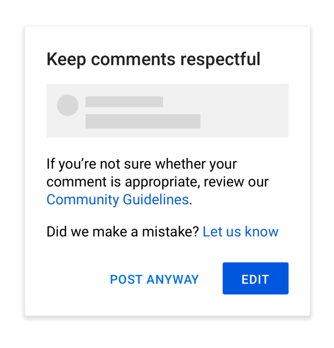

# Classify Toxic Comments

# Project Motivation

For this project, I used Kaggle open dataset 'Toxic Comments Classification' from 2017 to enhance my knowledge in:

	GloVe word embedding
	Text pre-processing
	LSTM neural networks

# Problem Statement**

The Conversation AI team, a research initiative founded by Jigsaw and Google (both a part of Alphabet) are working on tools to help improve online conversation. One area of focus is the study of negative online behaviors, like toxic comments (i.e. comments that are rude, disrespectful or otherwise likely to make someone leave a discussion). 
This competition aims to build a multi-headed model that’s capable of detecting different types of toxicity - severe_toxic, obscene, threat, insult, identity_hate. The model should predict a probability for each type of toxicity for each comment.

# Installation

* Anaconda Distribution of Python
* TensorFlow
* sklearn
* keras
* GloVe word embeddings

# File Description

This dataset contains a large number of comments from Wikipedia’s talk page edits, which have been labeled by human raters for toxic behavior.

# Approach

* Tokenized and integer encoded the comments
* Padded dataset to reduce input size
* Loaded GloVe embeddings and created embedding matrix for words present in dataset
* Initialize LSTM model with the embedding layer. One output neuron for each type of toxicity with Sigmoid activation.
* Run the model with Adam optimizer and Early Stopping rule that checks for validation set loss
* Save the trained model which is able to distinguish between different types of toxicity in comments
